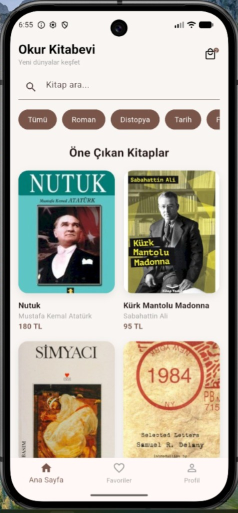
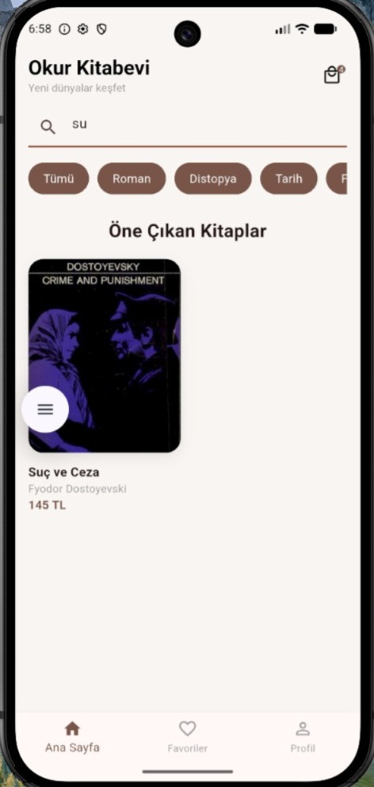
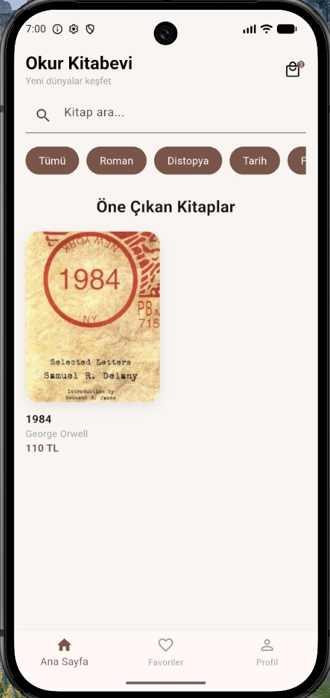
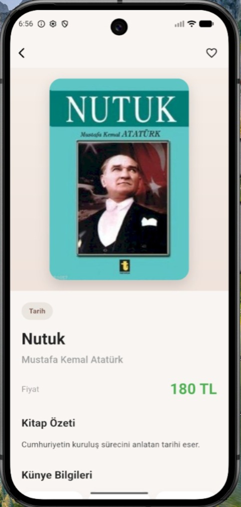
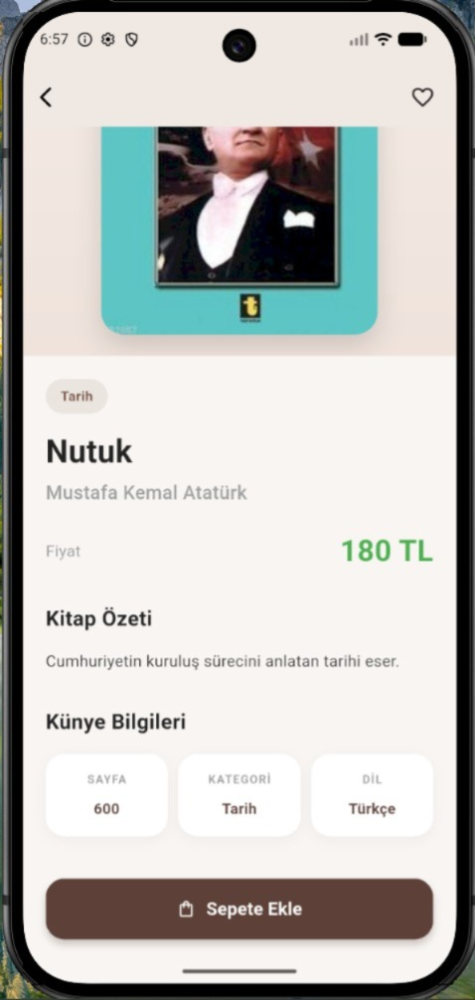
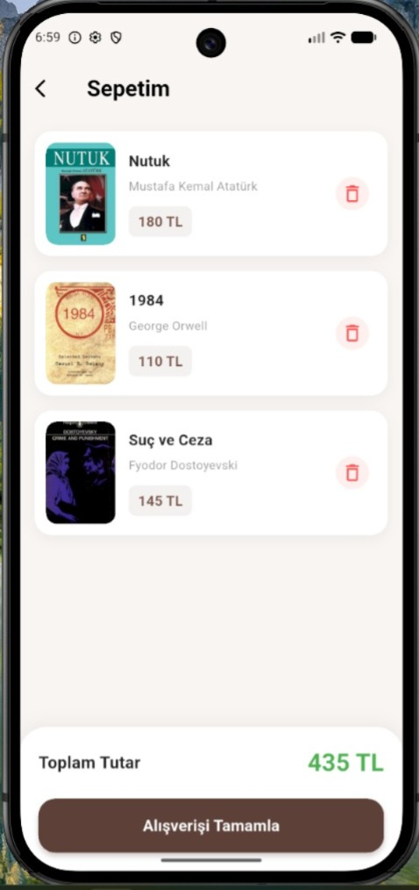

Book App Flutter

Bu proje, Flutter framework’ü kullanılarak geliştirilmiş bir mobil kitap listeleme ve satış uygulamasıdır. Uygulamanın temel amacı, kullanıcıların dijital ortamda kitaplara hızlı, düzenli ve kullanıcı dostu bir arayüz üzerinden erişimini sağlamaktır.
Sistem içerisinde kullanıcılar, kitapları liste halinde görüntüleyebilmekte; arama fonksiyonu aracılığıyla istedikleri kitaba hızlı bir şekilde ulaşabilmektedir. Ayrıca kategori bazlı filtreleme özelliği sayesinde kitaplar türlerine göre sınıflandırılarak daha organize bir gezinme deneyimi sunulmaktadır.
Kullanıcılar seçtikleri kitapların detay sayfalarına erişerek kitap hakkında yazar, açıklama, yayınevi ve puan gibi bilgilere ulaşabilmektedir. Bunun yanı sıra kitaplar sepete eklenebilmekte ve alışveriş süreci simüle edilmektedir.
Geliştirilen bu uygulama, Flutter’ın sunduğu widget yapısı ve state management özellikleri kullanılarak modüler bir mimari ile tasarlanmış olup, kullanıcı deneyimini ön planda tutan modern bir arayüz yaklaşımı benimsenmiştir.

Uygulama Özellikleri
-Kitap listeleme ekranı
-Kitap detay sayfası
-Sepete kitap ekleme
-Arama ile kitap filtreleme
-Kategori filtreleme

Kullanılan Teknolojiler
Flutter (Flutter 3.41.9)
Dart

Çalıştırma Adımları

Projeyi çalıştırmak için aşağıdaki adımları takip edin:
git clone https://github.com/Zehra2706/Book-App-Flutter.git
cd Book-App-Flutter
flutter pub get
flutter run

Ekran Görüntüleri

 Ana Sayfa (Katalog)

 Kitap Detay Sayfası

 Sepet / Okuma Listesi

